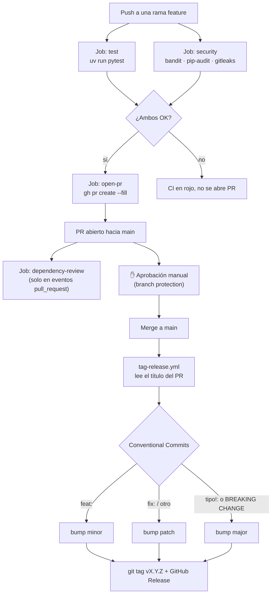

# 🛡️ Warden

Warden: Automatización inteligente para la resiliencia de software. Es un agente autónomo que protege tus Plataformas Internas de Desarrollo (IDPs). Al recibir alertas mediante webhooks, Warden usa IA (LLMs) para analizar el fallo y resolverlo de forma autónoma, derivando el problema a un humano únicamente si la situación lo requiere.

## 📋 Requisitos

- 🐳 Docker y Docker Compose (para correr el servicio completo)
- 🐍 [uv](https://docs.astral.sh/uv/) y Python 3.14 (para desarrollo local y tests)
- 🔑 API Key de Groq (https://console.groq.com)

## ⚙️ Configuración

1. Clonar el repositorio:
   ```bash
   git clone https://github.com/leonardoalmeidac/warden.git
   cd warden
   ```

2. Crear el archivo de entorno:
   ```bash
   cp .env.example .env
   ```
   Configura tu `GROQ_API_KEY` en el archivo `.env`.

3. Iniciar los servicios:
   ```bash
   docker compose up --build
   ```
   El servicio estará disponible en `http://localhost:9000`.

4. Desarrollo local con `uv` (sin Docker):
   ```bash
   uv sync
   uv run alembic upgrade head   # requiere DATABASE_URL apuntando a un Postgres
   uv run granian --interface asgi --reload --port 9000 src.main:app
   ```

5. Ejecutar las pruebas:
   ```bash
   uv run pytest -v
   ```
   Las pruebas no requieren Postgres ni una `GROQ_API_KEY` real: usan SQLite en
   memoria y un proveedor LLM falso (`FakeReasoningProvider`) inyectado vía
   `app.dependency_overrides`.

### 📖 Documentación interactiva (Swagger / ReDoc)

FastAPI expone la documentación automáticamente, sin configuración adicional. Con
el servicio levantado:

- **Swagger UI** (probar los endpoints desde el navegador): http://localhost:9000/docs
- **ReDoc** (solo lectura, más legible): http://localhost:9000/redoc
- **Schema OpenAPI crudo**: http://localhost:9000/openapi.json

### 🧪 Ejemplos `curl` por endpoint

#### `GET /health` — Verificación del estado del servicio
```bash
curl -s http://localhost:9000/health
```

#### `POST /events` — Ingesta de una señal de degradación
```bash
curl -s -X POST http://localhost:9000/events \
  -H "Content-Type: application/json" \
  -d '{
    "project_id": "payments-api",
    "environment_id": "prod",
    "severity": "high",
    "signal": "P99 latency spiked to 4s after the 14:30 deploy",
    "context": {"last_deploy": "v2.3.1", "cpu_usage": "85%", "error_rate": "12%"},
    "timestamp": "2024-04-03T14:45:00Z"
  }'
```
> 💡 Si `severity` es `critical`, o el entorno es `prod` y la acción recomendada es
> `rollback`/`scale_up`, la respuesta siempre va a traer `safe_to_auto: false` y un
> `approval_id` — sin importar qué tan segura diga estar el LLM. Para ver un caso
> que se ejecute solo, probá con `environment_id: "dev"` y `severity: "low"`.

#### `GET /events` — Listar eventos recibidos
```bash
curl -s http://localhost:9000/events
```

#### `GET /events/:id` — Detalle de un evento junto con la decisión tomada
```bash
curl -s http://localhost:9000/events/<event_id>
```

#### `GET /approvals` — Solicitudes de aprobación pendientes
```bash
curl -s http://localhost:9000/approvals
```

#### `POST /approvals/:id/approve` — Aprobar y ejecutar una acción pendiente
```bash
curl -s -X POST http://localhost:9000/approvals/<approval_id>/approve \
  -H "Content-Type: application/json" \
  -d '{"feedback": "Confirmado con el equipo, adelante"}'
```
El body es opcional; sin `feedback`, se guarda el texto por defecto "Human approved the action".

#### `POST /approvals/:id/reject` — Rechazar una acción pendiente
```bash
curl -s -X POST http://localhost:9000/approvals/<approval_id>/reject \
  -H "Content-Type: application/json" \
  -d '{"feedback": "Muy riesgoso para este horario"}'
```
El body es opcional; sin `feedback`, se guarda el texto por defecto "Human rejected the action".

## 🏗️ Arquitectura

```
src/
  config.py         Settings único (pydantic-settings), sin os.getenv disperso
  main.py           App factory FastAPI, lifespan, /health, manejo global de errores
  domain/           Modelos puros (DegradationEvent, RemediationDecision, HistoryEntry, enums)
  db/               Engine/Session de SQLAlchemy + modelos ORM (*Record)
  repositories/     Una clase por agregado; encapsulan todas las queries SQLAlchemy
  llm/              Protocol ReasoningProvider + GroqProvider + prompt_builder + response_parser
  policies/         SafetyPolicy aplica una lista de SafetyRule (Chain of Responsibility)
  actions/          Strategy: un ActionHandler por acción + ActionRegistry
  history/          HistoryService arma el historial de un proyecto desde los repos
  reasoning/        ReasoningEngine orquesta provider + prompt + parser + policy + historial
  services/         EventIngestionService y ApprovalService (orquestación de caso de uso)
  api/              deps.py (composition root), schemas.py (DTOs HTTP), routers delgados
mocks/              orchestrator.py y notifications.py — ahora sí invocados por actions/
```

### 🎯 Decisiones de diseño

- **Repository** (`repositories/`) aísla SQLAlchemy del resto del dominio y elimina
  la duplicación de queries.
- **Protocol-based DIP** (`llm/provider.py`, `actions/base.py`): el motor de
  razonamiento no depende de Groq concretamente, y la app no depende de un
  orquestador real. Soportar otro proveedor LLM solo requiere una clase nueva que
  cumpla `ReasoningProvider`.
- **Chain of Responsibility simplificado** (`policies/safety_policy.py`): cada
  restricción de `safe_to_auto` es una clase `SafetyRule` independiente y testeable;
  agregar una restricción nueva no toca las demás.
- **Strategy** (`actions/`): cada acción de remediación es un `ActionHandler`
  intercambiable; `ActionRegistry` los despacha por `ActionType`. Los handlers invocan `mocks/orchestrator.py` y `mocks/notifications.py`.
- Cuando `safe_to_auto` es `false`, además de crear el approval request,
  `EventIngestionService` notifica al on-call vía `mocks/notifications.notify_oncall`
  (no solo cuando la acción elegida por el LLM es `notify_human`).
- **Composition root manual** (`api/deps.py`): un solo lugar ensambla repos,
  provider, policy, registry y servicios concretos con sus dependencias. No se
  introduce un framework de DI adicional — FastAPI `Depends` ya resuelve el grafo.
- `RemediationDecision` es inmutable (`frozen=True`); aplicar restricciones de
  seguridad devuelve una copia (`with_safe_to_auto`) en lugar de mutar el dict
  original.

## 🔄 CI

Dos workflows de GitHub Actions (`.github/workflows/`) cubren todo el ciclo desde un
push hasta el release, sin pasos manuales más allá de la aprobación del PR:



### `ci.yml` — se dispara en cada push y en cada PR hacia `main`

| Job | Cuándo corre | Qué hace |
| --- | --- | --- |
| `test` | siempre | `uv run pytest -v` |
| `security` | siempre | `bandit` (SAST sobre `src/`), `pip-audit` (vulnerabilidades en el lockfile), `gitleaks` (secretos en el historial de commits, vía `docker run ghcr.io/gitleaks/gitleaks`) |
| `dependency-review` | solo `pull_request` | compara las dependencias del PR contra `main` (usa el Dependency graph de GitHub) |
| `open-pr` | solo `push` a una rama que no sea `main`, y solo si `test`+`security` pasaron | abre automáticamente el PR hacia `main` con `gh pr create --fill` (no duplica si ya hay uno abierto) |

### `tag-release.yml` — se dispara cuando un PR hacia `main` se cierra

Solo actúa si el PR se mergeó (`merged == true`). Calcula el bump leyendo el
**título del PR** en formato Conventional Commits (`feat:` → minor, cualquier otro
prefijo → patch, `tipo!:` o `BREAKING CHANGE` → major), calcula el siguiente
`vX.Y.Z` a partir del último tag existente, lo pushea y crea un GitHub Release con
notas autogeneradas.

